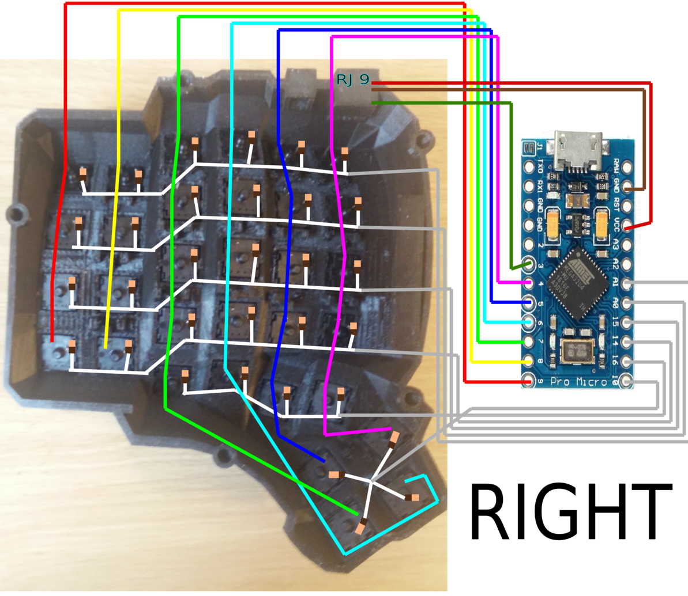

# Dactyl-manuform build guide

这是一篇关于 **dactyl-manuform 5x6** 的小白友好 (~~因为我本身就是小白~~) 的中文组建指南，如果你没有任何组建键盘的经验(~~比如我~~)，通过阅读本指南，你大概可以对整个流程有清晰一点的了解。本指南是基于我组建此键盘的经历的一些经验分享，以及一些网上不容易找到的一些资源的整合。

pic

## 物料准备

|名称|数量|价格(估计)|备注|
|---|---|---|---|
|Arduino Pro Micro|2|76 (38*2)||
|轴体|64|96 (1.5*64)||
|RJ9 插头|1|5|又叫电话机听筒线、123线序头|
|开关二极管1N4148|64|3.8|一般按100个一包购买|
|40p杜邦线|1|2|建议 30cm 以上|
|M3\*5 平头螺丝|10|4|M3\*5 是规格 螺纹内经 3mm 长度 5mm 一般100个一包|
|注塑热容螺母 M3\*4\*5|10|11|100个一包|
|铜箔胶带|1|10|建议宽度小于等于 1cm|
|防静电胶带|1|9|透明的较好|
|type-c母 to micro-usb公转接线|2|30 (15*2)|线软、短一点好|
|电话机听筒线|1|5.5|座机连接线、4芯电话线|

共计: 252.3

键盘外壳需要 3D 打印，底板需要切割。如果你没有 3D 打印或切割条件，那么你需要去找商家定制，价格参考：

|名称|数量|价格|备注|
|---|---|---|---|
|外壳|2 (左 右)|122 (45*2+32快递)|5x6 的左右 stl 文件|
|底板|2 (左 右)|50|5x6 底板 dxf 文件(原仓库只有一边，切割两个)|

共计: 172

同时，你需要有一些工具：

|名称|数量|价格|
|---|---|---|
|电烙铁|1|20 (便宜的)|
|热熔胶枪 (含胶棒)|1|20|

共计: 40

## 组建

**组建过程可以直接查看 [此 YouTube 播放列表](https://youtube.com/playlist?list=PLJcTwFs4jAY0VnJDXhexZw7X3OIjXQkiY)**

由于原视频已经足够详细，这里仅对一些细节或是视频里面疏忽的地方进行补充

1. 在[第一个视频](https://www.youtube.com/watch?v=dWC_8BOArzc&list=PLJcTwFs4jAY0VnJDXhexZw7X3OIjXQkiY&index=1) 中 第一步你需要先把*注塑热容螺母*放置到外壳螺母放置位置，用电烙铁加热并轻轻按压

2. 在[第四个视频](https://www.youtube.com/watch?v=Oloh3Yabu6I&list=PLJcTwFs4jAY0VnJDXhexZw7X3OIjXQkiY&index=4) 18分20秒 你不应该按照视频的颜色链接，而该按照[此图](https://github.com/tshort/dactyl-keyboard/blob/master/resources/dactyl_manuform_left_wire_diagram.png)的颜色连接。同时[右侧](https://github.com/tshort/dactyl-keyboard/blob/master/resources/dactyl_manuform_right_wire_diagram.png)连接方式也不同
   

## 固件

参考[第五个视频](https://www.youtube.com/watch?v=fR-w97o7dgg&list=PLJcTwFs4jAY0VnJDXhexZw7X3OIjXQkiY&index=5)

首先如果你要跟视频步骤，不要使用[此](https://github.com/tshort/qmk_firmware/tree/master/keyboards/dactyl-manuform)仓库下的固件

Windows 用户请直接按照视频教程 附上[qmk文档](https://docs.qmk.fm/)

Linux 和 macOS 可以参考视频直接按照文档步骤，建议使用终端代理

