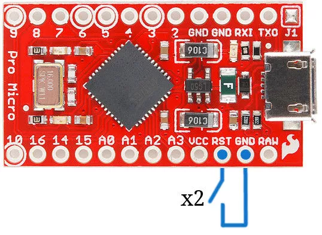

# Dactyl-manuform build guide (handwired)

这是一篇关于 [dactyl-manuform](https://github.com/tshort/dactyl-keyboard) 的小白友好 (~~因为我本身就是小白~~) 的中文组建指南，如果你没有任何组建键盘的经验(~~比如我~~)，通过阅读本指南，你大概可以对整个流程有清晰一点的了解。本指南是基于我组建此键盘的经历的一些经验分享，以及一些网上不容易找到的一些资源的整合。


## 物料准备

|名称|数量|价格(估计)|备注|
|---|---|---|---|
|Arduino Pro Micro|2|76 (38*2)||
|轴体|64|96 (1.5*64)||
|RJ9 插头|1|5|又叫电话机听筒线、123线序头|
|开关二极管1N4148|64|3.8|一般按100个一包购买|
|40p杜邦线|1|2|建议 30cm 以上|
|M3\*5 平头螺丝|10|4|M3\*5 是规格 螺纹内经 3mm 长度 5mm 一般100个一包|
|注塑热容螺母 M3\*4\*5|10|11|100个一包|
|铜箔胶带|1|10|建议宽度小于等于 1cm|
|防静电胶带|1|9|透明的较好|
|type-c母 to micro-usb公转接线|2|30 (15*2)|线软、短一点好|
|电话机听筒线|1|5.5|座机连接线、4芯电话线|

共计: 252.3

键盘外壳需要 3D 打印，底板需要切割。如果你没有 3D 打印或切割条件，那么你需要去找商家定制，价格参考：

|名称|数量|价格|备注|
|---|---|---|---|
|外壳|2 (左 右)|122 (45*2+32快递)|5x6 的左右 stl 文件|
|底板|2 (左 右)|50|5x6 底板 dxf 文件(原仓库只有一边，切割两个)|

共计: 172

同时，你需要有一些工具：

|名称|数量|价格|
|---|---|---|
|电烙铁|1|20 (便宜的)|
|热熔胶枪 (含胶棒)|1|20|

共计: 40


## 组建
 
**组建过程可以直接查看 [此 YouTube 播放列表](https://youtube.com/playlist?list=PLJcTwFs4jAY0VnJDXhexZw7X3OIjXQkiY)**

由于原视频已经足够详细，这里仅对一些细节或是视频里面疏忽的地方进行补充

1. 在组建键盘前你可以选择打磨 3D 打印件，以获得更好的手感

2. 在[第一个视频](https://www.youtube.com/watch?v=dWC_8BOArzc&list=PLJcTwFs4jAY0VnJDXhexZw7X3OIjXQkiY&index=1) 中 第一步你需要先把*注塑热容螺母*放置到外壳螺母放置位置，用电烙铁加热并轻轻按压

3. 在[第四个视频](https://www.youtube.com/watch?v=Oloh3Yabu6I&list=PLJcTwFs4jAY0VnJDXhexZw7X3OIjXQkiY&index=4) 18分20秒 你不应该按照视频的颜色链接，而该按照[此图](https://github.com/tshort/dactyl-keyboard/blob/master/resources/dactyl_manuform_left_wire_diagram.png)的颜色连接。同时[右侧](https://github.com/tshort/dactyl-keyboard/blob/master/resources/dactyl_manuform_right_wire_diagram.png)连接方式也不同
   


3. 在[第四个视频](https://www.youtube.com/watch?v=Oloh3Yabu6I&list=PLJcTwFs4jAY0VnJDXhexZw7X3OIjXQkiY&index=4)中作者最后在底板上加了个 <kbd>reset</kbd> 开关，在后面刷固件部分会用到。如果你觉得烦的话你其实可以跳过这步，稍后会讲到替代方法，只是稍微麻烦一点点

## 固件

参考[第五个视频](https://www.youtube.com/watch?v=fR-w97o7dgg&list=PLJcTwFs4jAY0VnJDXhexZw7X3OIjXQkiY&index=5)

首先如果你要跟视频步骤，***不要*** 使用[此](https://github.com/tshort/qmk_firmware/tree/master/keyboards/dactyl-manuform)仓库下的固件

Windows 用户请直接按照视频教程 因为在环境准备上需要额外步骤。附上[qmk文档](https://docs.qmk.fm/)

Linux 和 macOS 可以参考视频直接按照文档步骤，下载时建议使用终端代理

### 生成 hex 文件

视频中作者第一次编译的 <code>keymap</code> 为 <code>default</code>，在之后才演示了如何自定义 <code>keymap</code>。我建议在第一次刷固件之前就修改好自己的 <code>keymap</code>，否则你可能需要重复刷固件多次才能找到你满意的 <code>keymap</code>

你可以参考[我用的keymap配置文件](https://github.com/wivl/configs/tree/main/keymaps)

编译 <code>keymap</code> 请参考视频

```
qmk compile -kb handwired/dactyl_manuform/5x6 -km macos
```
其中 <code>macos</code> 为我自己的 <code>keymap</code> 命名，请换成你自己的

### 刷固件

**刷固件前需要断开连接两个键盘的听筒线，并且两侧都需要刷**

在刷固件时，如同视频所说，你需要 <code>reset</code> arduino，但是如果你没有在底板上钻孔设置开关的话，你需要手动进行接线 reset。

首先你需要一根杜邦线


然后两端分别连接 <kbd>RST</kbd> 和 <kbd>GND</kbd>。其中 <kbd>GND</kbd> 有 3 个，有一个已经被占用，所以随便选择剩下两个中的一个即可。



打开下载好的 <code>qmk toolbox</code>，加载编译好的 <code>.hex</code> 文件

连接 usb 给 arduino 通电的情况下 <code>reset</code>，然后点 <code>flash</code> 按钮。

> 如果你发现 reset arduino 后 qmk toolbox 才检测到连接，并且几秒后自动断开，那么你需要在 reset 并且检测到连接后快速进行 flash

### DEBUG
默认设置为将 usb 连接到左侧键盘，即左键盘为 master，右键盘为 slave，你可以在 你的 keymap 文件夹中的 <code>config.h</code> 设置

```c
#define MASTER_RIGHT
```
并注释掉
```c
#define MASTER_LEFT
```


* 如果 usb 连接在左右键盘都可以使用 （键位是对称的，这是正常情况。这取决于键盘 master-slave 关系的设置）那么固件就是正常工作的。

* 如果某个按键不响应，但是同排同列的按键都正常使用，说明当前按键的某个针脚焊接不到位，可以加一点锡

* 如果某一排或者某一列按键都不响应，可能是连接行或列的线接触不良

* 如果按一个按键触发很多按键，可能是 arduino 针脚接触到了裸露的线缆，可以使用防静电胶布包裹线缆

* 如果刷固件之后 usb 连接两侧都只有 master 可以正常使用，那么可能是你的 rj9 接口线缆接错，参考上面的连接图纠正。正常连接时 slave 的 arduino 将亮黄灯

* 如果排除上述错误 slave 还是不可以使用，在 <code>config.h</code> 里加上

```c
#define SPLIT_USB_DETECT
#define SPLIT_USB_TIMEOUT 2000
```

## 参考资料

[Kevin Eckert 的 YouTube 视频](https://www.youtube.com/playlist?list=PLJcTwFs4jAY0VnJDXhexZw7X3OIjXQkiY)

[tshort/dactyl-keyboard](https://github.com/tshort/dactyl-keyboard)

[qmk 文档](https://docs.qmk.fm/)

[reset arduino](https://www.shellhacks.com/arduino-pro-micro-reset-restore-bootloader/)

[slave 无响应解决方法](https://github.com/qmk/qmk_firmware/issues/9697)

[一些排错](https://docs.splitkb.com/hc/en-us/articles/360010588860-Only-one-half-of-my-keyboard-works-at-a-time-but-not-when-they-are-both-connected)


